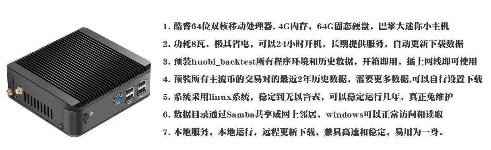

# huobi_backtest
> 数字货币回测行情服务器- 收费版

* 根据需求，自动提前下好N年N多币种历史数据(1分钟线),回测服务器自动转换1分钟线成为日线，4小时线，1小时等，并全部调入内存数据库，以便达到每个get_price()调用 小于 1.5ms的超高速历史回测行情，用最短的时间验证你的想法和策略 (从理论到实践，真金白银需要三思而行) 

### 功能特点
* 系统可以获取从2015年至今所有火币上线币种的全部历史行情，各个币种对都能精确到1分钟线。某网出售1分钟线的历史数据，每个币种20元，我们这个项目这里全包括了，历史行情数据不再需要外购

* 系统调用API同我们的开源的火币行情服务器huobi_info完全一致 ( https://github.com/mpquant/huobi_intf ),原则上是希望一套代码通行回测和实盘

* API价格获取： `get_price('btc.usdt', end_date='2017-09-04 13:56:00', count=8000, frequency='1h')`   
  熟悉的味道，熟悉的功能，系统在内部已经把1分钟线合成日线，4小时线，1小时线，15分钟线，5分钟线等，支持2015年后历史任意时间，任意条数数据获取

* 行情服务器编程语言是python,采用高性能异步网络框架tornado做WebApi, 标准json返回，所有语言都能方便调用

* 系统采用csv标准格式记录历史数据，一个币种一个文件，便于其他工具分析，分享，保存 (具体格式参考下面表格BTC.USDT)
    |date|open|close|low|high|money|volume|
    |----|----|----|----|----|----|-------|
    |2020-01-01 00:00:00|7194.7|7200.0|7186.19|7200.0|102.743|738706.346|
    |2020-01-01 00:01:00|7200.0|7218.2|7199.99|7219.58|70.711|509693.211|
    |2020-01-01 00:02:00|7218.21|7216.22|7213.09|7218.44|17.445|125889.77|
    |2020-01-01 00:03:00|7216.21|7218.37|7215.48|7221.91|13.034|94091.100|
    |2020-01-01 00:04:00|7218.37|7213.05|7210.01|7220.13|14.005|101042.531|

*  系统启动后，自动将csv数据文件的分钟线转换成`日线`，`4小时线`，`60分钟线`等放入内存，等待调用，由于是内存高速调用，不再通过文件io或数据库交换，所以可以保证每次`get_price()`调用不会超过**2ms**的超高性能，大大提高了回测速度

* 行情数据是量化的基础，历史数据更是一切策略回测的根本，**huobi_backtest** 为您提供最稳定可靠，性能优异的回测服务

### 一键交付模式：我们提供`云服务交付模式`，或者`迷你整机交付模式`
* 云服务器交付模式:  您提供VPS，我们负责安装好所有系统 （价格 **￥3800元/套** 含一年升级服务费)

* 整机本地交付模式： 一台小主机，安装好所有系统快递给您 （价格 **￥4280元/套** 含硬件主机一套)

  

* 咨询，购买等更多细节扫描下面二维码

----------------------------------------------------
### 巴特量化
* 数字货币 股市量化工具 行情系统软件开发

* BTC虚拟货币量化交易策略开发 自动化交易策略运行

----------------------------------------------------

 
